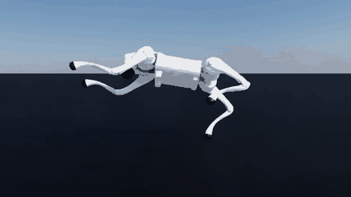
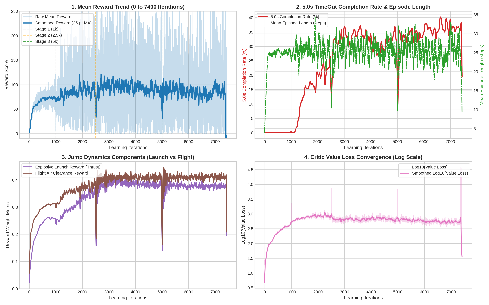

# Unitree Go2 単脚連続跳躍 強化学習

NVIDIA Isaac Lab および RSL-RL を使用した、四足歩行ロボット Unitree Go2 による単脚連続跳躍（Single-Leg Continuous Jump）を中心とする強化学習リポジトリです。

---

## 1. 単脚連続跳躍の学習推移と動作比較

右後脚（RR）1本のみを支持脚とし、他の3脚を完全に浮かせた状態で連続跳躍を維持するタスクです。学習イテレーションの進展に伴う動作変化を以下に示します。

### 学習イテレーション別の比較

| 1,000 Iterations | 2,500 Iterations |
| :---: | :---: |
|  |  |
| **初期段階**<br>接地姿勢の保持が中心で跳躍高度は低く、生存時間は約1.4秒。 | **完走達成段階**<br>姿勢制御が安定し、5.0秒間のエピソード完走を初めて達成。 |

| 5,000 Iterations | 7,400 Iterations |
| :---: | :---: |
|  |  |
| **高跳躍段階**<br>跳躍の蹴り出しが強化され、足先クリアランス最大 +51.6 cm を記録。 | **最終収束段階**<br>着地衝撃の吸収と離陸の連動が最適化され、完走率 37.8% を達成。 |

---

### つま先接地制御

| 純粋つま先接地跳躍 |
| :---: |
|  |
| 膝や脛の接触を完全に排除し、足先リンクのみで着地と蹴り出しを行う動作制御。 |

---

## 2. 定量的ベンチマークと学習曲線

GPU 4,096並列環境における学習曲線の推移と各段階の物理指標です。



### 各学習段階の性能指標

| 学習ステージ | 連続生存時間 | 最大足先クリアランス | 垂直離陸速度 $V_z$ | 空中滞空率 | 5秒完走率 |
| :--- | :--- | :--- | :--- | :--- |
| Stage 1 (1,000 Iterations) | 1.42 秒 | +35.4 cm | +1.28 m/s | 94.0% | 7.4% |
| Stage 2 (2,500 Iterations) | 5.00 秒 | +41.3 cm | +0.97 m/s | 99.2% | 26.5% |
| Stage 3 (5,000 Iterations) | 5.00 秒 | +51.6 cm | +1.02 m/s | 98.8% | 28.9% |
| Stage 4 (7,400 Iterations) | 5.00 秒 | +43.7 cm | +1.23 m/s | 98.8% | 37.8% |

浮かせた3脚（FL, FR, RL）は常に +14.5 cm から +45.6 cm の高度に保持され、地面との接触は生じていません。

---

## 3. その他の変則歩行タスク

本プロジェクトで構築したその他の歩行タスクの動作です。

| 3脚けんけん歩行 | 右側2脚走行 | 後足2足立ち歩行 |
| :---: | :---: | :---: |
|  |  |  |
| 1脚を浮かせた状態でのホッピング前進（6秒間で3.62 m移動） | 左側2脚を浮かせた同側2脚でのバランス走行（6秒間で3.74 m移動） | 前足2本を持ち上げた直立姿勢でのバランス歩行 |

---

## 4. リポジトリ構成

```text
REINFORCEMENT/
├── README.md                      # メインドキュメント
├── HANDOVER.md                    # 開発引き継ぎ書・報酬設計方針
├── .gitignore                     # ログおよびローカル実験ファイルの除外設定
│
├── models/                        # 学習済みモデル重みファイル
│   ├── single_leg_jump_7400iter.pt# 単脚連続跳躍 7400 iter モデル
│   ├── single_leg_jump_5000iter.pt# 単脚連続跳躍 5000 iter モデル
│   ├── hopping_3leg_best.pt       # 3脚けんけんモデル
│   ├── right_side_2leg_best.pt    # 右側2脚走行モデル
│   └── bipedal_hind_leg_best.pt   # 後足2足立ちモデル
│
├── assets/                        # デモGIF・画像・動画ファイル
│   ├── single_leg_1000iter.gif
│   ├── single_leg_2500iter.gif
│   ├── single_leg_5000iter.gif
│   ├── single_leg_7400iter.gif
│   ├── single_leg_pure_toe.gif
│   ├── training_curves_7400.png
│   └── videos/
│
├── go2_single_leg/                # 単脚連続跳躍 環境・報酬・学習コード
├── go2_hopping/                   # 3脚けんけん 環境・報酬・学習コード
├── go2_right_side/                # 右側2脚走行 環境・報酬・学習コード
├── go2_bipedal/                   # 後足2足立ち 環境・報酬・学習コード
│
├── eval_single_leg_master.py      # 単脚跳躍モデル評価スクリプト
└── analyze_convergence.py         # 学習ログ解析スクリプト
```

---

## 5. 環境セットアップ

### 前提条件
* Ubuntu 22.04 または 24.04 LTS
* NVIDIA GPU（RTX 3060以上、CUDA 12対応環境）
* Isaac Lab 3.0以上および RSL-RL

### インストール手順
```bash
conda create -n isaaclab python=3.12 -y
conda activate isaaclab

cd /path/to/IsaacLab
pip install -e source/isaaclab
pip install -e source/isaaclab_tasks
pip install -e source/isaaclab_rl
pip install -e source/isaaclab_assets
pip install rsl-rl-lib gymnasium matplotlib imageio Pillow
```

---

## 6. 評価および学習の実行方法

### 学習済みモデルの評価実行
7,400イテレーションの単脚跳躍モデルを読み込み、5秒間の動作評価および動画保存を行います。

```bash
conda activate isaaclab
python eval_single_leg_master.py
```

### 各タスクのシミュレーション再生
```bash
# 単脚連続跳躍
cd go2_single_leg && python play.py --checkpoint ../models/single_leg_jump_7400iter.pt

# 3脚けんけん歩行
cd go2_hopping && python play.py --checkpoint ../models/hopping_3leg_best.pt

# 右側2脚走行
cd go2_right_side && python play.py --checkpoint ../models/right_side_2leg_best.pt

# 後足2足立ち歩行
cd go2_bipedal && python play.py --checkpoint ../models/bipedal_hind_leg_best.pt
```

### 再学習の実行
```bash
cd go2_single_leg
python train.py --num_envs 4096 --max_iterations 2500
```

---

## 7. 制御設計および報酬設計の知見

1. **遷移型カリキュラムによる着地安定化**
   空中姿勢からの直接スポーンでは着地衝撃による転倒が発生しやすいため、4脚接地姿勢で安定させてから目標脚のリフトへ移行させる遷移設計を採用。
2. **接触判定による不正解の排除**
   非接触対象リンクの足先だけでなく、膝・脛・太もも・胴体全般の接触判定と最低高度判定を設定し、地面を引きずる動作を防止。
3. **滞空時間報酬と速度追従の併用**
   足上げ姿勢のみでの静止局所解を防ぐため、支持脚の滞空時間報酬と速度追従項を適切に設定し、連続的な跳躍運動を誘導。
